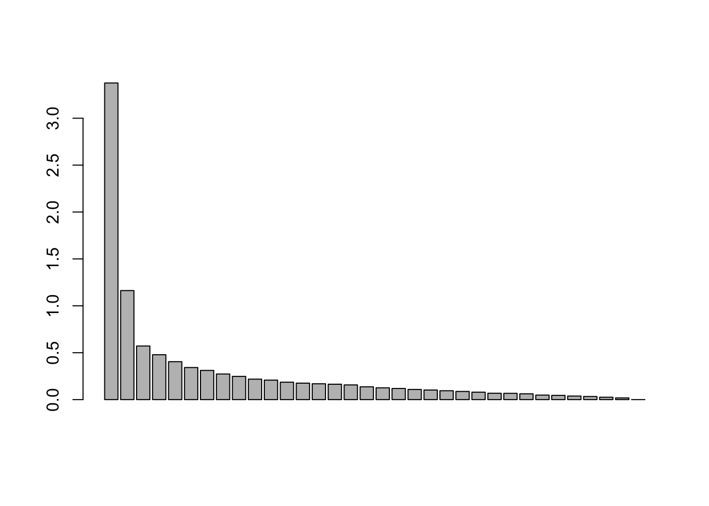

### Install necessary packages


```r
library(ggplot2); packageVersion("ggplot2")
theme_set(theme_bw())
library(dplyr); packageVersion("dplyr")
library(tidyverse); packageVersion("tidyverse")
#for decontaminating and filtering
library(decontam); packageVersion("decontam")
#for maps
library(rgdal); packageVersion("rgdal")
library(lubridate); packageVersion("lubridate")
library(sf); packageVersion("sf")
library(rgeos); packageVersion("rgeos")
library(here); packageVersion("here")
library(ggspatial); packageVersion("ggspatial")
library(rnaturalearth); packageVersion("rnaturalearth")
library(rnaturalearthdata); packageVersion("rnaturalearthdata")
#For ordinations and other microbial community analyses
library(phyloseq); packageVersion("phyloseq")
library(vegan); packageVersion("vegan")
library(corncob); packageVersion("corncob")
library(reshape2); packageVersion("reshape2")
library(randomcoloR); packageVersion("randomcoloR")
library(cowplot); packageVersion("cowplot")
library(grid); packageVersion("grid")
```

## Filtering and clean-up of Data

### Data for Appendix 1 and Appendix 2 are included in this section.

I would like to do filtering out of mitochondrial, chloroplast, and unclassified ASV sequences. Additionally, I will filter out the DNA extraction control contaminants likely introduce from DNA extraction kit reagents and then filter out the likely seawater-derived ASVs because the method of collecting tissue with syringes introduces significant amounts of seawater. To do this I will use the decontam packages and employ the combined function for the DNA extraction controls and the prevalence function for the Syringe Method Control samples compared to Coral Tissue syringe samples.


```r
asv <- read.table("ASV_STT2020.txt", sep = "\t", header = TRUE, row.names = 1)
taxa <- as.matrix(read.table("taxonomy_STT2020_nospecies.txt", sep = "\t", header = TRUE, row.names = 1))
metadata <- read.table("metadata_STT2020.txt", sep = "\t", header = TRUE, row.names = 1)

#because my sample names start with an X, I need to replace all the captial X's with nothing so that they match the metadata names
colnames(asv) <- str_replace_all(colnames(asv), pattern = "[X]", "")
colnames(asv) <- str_replace_all(colnames(asv), pattern = "[.]", "-")
asv <- t(asv)

#order the metadata so it matches the ASV table
idx <- match(rownames(asv), rownames(metadata))
metadata <- metadata[idx,]

ASV = otu_table(asv, taxa_are_rows = FALSE)
TAX = tax_table(taxa)
META = sample_data(metadata)

ps <- phyloseq(ASV, TAX, META)

#Remove mock community and phiX samples, but RETAIN the SW and DNA controls
ps <- subset_samples(ps, samplecategory == "coral")

length(get_taxa_unique(ps, "Family")) #number of unique family samples = 359. This will have 
length(get_taxa_unique(ps, "Order")) #number of unique order samples = 255
get_taxa_unique(ps, "Kingdom") #print unique Kingdoms. Need to get rid of Eukaryota and NA
ps2 <- ps %>%
  phyloseq::subset_taxa(Family != "Mitochondria") %>%
  phyloseq::subset_taxa(Order !="Chloroplast") %>%
  phyloseq::subset_taxa(Kingdom !="Eukaryota") %>%
  phyloseq::subset_taxa(Kingdom !="NA")

length(get_taxa_unique(ps2, "Family")) #347
length(get_taxa_unique(ps2, "Order")) #158
length(get_taxa_unique(ps2, "Kingdom")) #2
#7366 taxa and 119 samples

# save the tables with no Eukaryotic/Mitochondrial/Chloroplast/Unknown sequences for use in other analyses 
write.table(as(otu_table(ps2), "matrix"),"ASV_STT2020_no_chloromito.txt",sep="\t",col.names=NA)
write.table(as(tax_table(ps2), "matrix"),"taxonomy_STT2020_nospecies_no_chloromito.txt",sep="\t",col.names=NA)
write.table(as(sample_data(ps2), "matrix"),"metadata_STT2020_no_chloromito.txt",sep="\t",col.names=NA)

# Load in the chloro/mito filtered data 
asv <- read.table("ASV_STT2020_no_chloromito.txt",sep="\t",header=TRUE, row.names=1)
taxon <- as.matrix(read.table("taxonomy_STT2020_nospecies_no_chloromito.txt", sep="\t", header=TRUE, row.names=1))
meta <- read.table("metadata_STT2020_no_chloromito.txt",sep="\t",header=T,row.names=1)

ASV = otu_table(asv, taxa_are_rows = FALSE)
TAX = tax_table(taxon)
META = sample_data(meta)

ps <- phyloseq(ASV, TAX, META)

# Filtering using the combined method for DNA extraction-based contaminants
contamdf.com <- isContaminant(ps, method = "combined", neg="is.neg", conc = "quant_reading")
head(contamdf.com)
table(contamdf.com$contaminant) #Looks like the combined method found 15 contaminants.
#Which ASVs were determined to be contaminants?
contamdf.com[contamdf.com$contaminant == "TRUE",]

#Make a similar prevalence plot as above,using the presence-absence info
# Make data.frame of prevalence in positive and negative samples
# Take a look at how Decontam marked out the different contaminants
# Make phyloseq object of presence-absence in negative controls and true samples
ps.pa <- transform_sample_counts(ps, function(abund) 1*(abund>0))
ps.pa.neg <- prune_samples(sample_data(ps.pa)$is.swctrl == "TRUE", ps.pa)
ps.pa.pos <- prune_samples(sample_data(ps.pa)$is.swctrl == "FALSE", ps.pa)
df.pa <- data.frame(pa.pos=taxa_sums(ps.pa.pos), pa.neg=taxa_sums(ps.pa.neg),
                      contaminant=contamdf.com$contaminant)
ggplot(data=df.pa, aes(x=pa.neg, y=pa.pos, color=contaminant)) + geom_point() +
  xlab("Prevalence (Negative Controls)") + ylab("Prevalence (True Samples)")
```


```r
# Check out some more contaminants using a similar graph as in the frequency method earlier, to make sure all IDd contaminatns "LOOK" like contaminants.
set.seed(100)
plot_frequency(ps, taxa_names(ps)[which(contamdf.com$contaminant)], conc="quant_reading") +
    xlab("DNA Concentration (Qubit 2.0 HS dsDNA Assay Stock Conc. ng/ul)")
```


```r
# Not all of these "contaminants" were present in DNA extraction controls. Only those in DNA extraction controls, where the frequency is greater than 0 are the following:
contaminants <- c("ASV87", "ASV103", "ASV104", "ASV140", "ASV167", "ASV205", "ASV228", "ASV316", "ASV330", "ASV711", "ASV1946")

#add an asv column to the contamdf.com dataframe and a column with the contaminants
contamdf.com$asv = rownames(contamdf.com)
contamdf.com$truecontam <- contamdf.com$asv %in% contaminants

#Check that this worked...should be 11 "TRUE"
table(contamdf.com$truecontam)

# Overall, I think I like the combined method best. It seems to combine the best of both worlds. Since I have data on both dna concentration AND which samples are DNA extraction controls, it seems like amore powerful method. 
# Remove contaminants from phyloseq object
ps.noncontam <- prune_taxa(!contamdf.com$truecontam, ps)
ps.noncontam #Now we have 11 fewer ASVs because we removed these

#Make a table summarising the contaminants you removed. 
DNAextraction.contam <- cbind(contamdf.com[contamdf.com$truecontam == TRUE,], tax_table(ps)[rownames(tax_table(ps)) %in% contaminants,])
write.table(DNAextraction.contam, "Appendix_1_DNAextraction_contaminants_decontam.txt", sep = "\t", col.names = NA) #Summary table - part of Appendix

# Get rid of the coral samples. I will try merging the phyloseq objects later. 
ps.noncontam.sw <- ps.noncontam %>%
  phyloseq::subset_samples(sampletype == "eco") %>%
  phyloseq::subset_samples(species != "DNACONTROL")

# Make a coral-only phyloseq object and produce the filtration step. This is to remove seawater-based contamination of the tissue/mucus slurry.
ps.noncontam.coral <- ps.noncontam %>%
  phyloseq::subset_samples(sampletype == "tiss") %>%
  phyloseq::subset_samples(species != "DNACONTROL")

coral_otu_relabund <- transform_sample_counts(ps.noncontam.coral, function(OTU) OTU/sum(OTU) ) #Get the relative abundance data for the coral samples

#column with TRUE == seawater control and FALSE == tissue samples is the 
contamdf.prev <- isContaminant(ps.noncontam.coral, method="prevalence", neg="is.swctrl")
head(contamdf.prev)

table(contamdf.prev$contaminant) #looks like lots of contaminants...184!
head(which(contamdf.prev$contaminant)) #Looks like higher abundance ASVs compared to the frequency method
swcontam <- rownames(contamdf.prev[contamdf.prev$contaminant == TRUE, ]) #make a list of the ASV names of the contaminants

#Make a summary table of the taxonomy and abundance of each contaminant ASV to evaluate it's contribtuion to the data
coraldata <- t(otu_table(coral_otu_relabund)) #subset and transform the otu relative abundance table so you can easily subset it by ASVs and add it to the contaminant summary
coralcontamdata <- as.data.frame(coraldata[rownames(coraldata) %in% swcontam, ])
coralcontamdata$meanabundance <- as.vector(apply(coralcontamdata, 1, mean))
SWsyringe.contaminants <- cbind(contamdf.prev[contamdf.prev$contaminant == TRUE, ], tax_table(coral_otu_relabund)[rownames(tax_table(coral_otu_relabund)) %in% swcontam, ], coralcontamdata[rownames(coralcontamdata) %in% swcontam,])
write.table(SWsyringe.contaminants, "Appendix_2_SyringeMethod_contaminants_decontam.txt", sep = "\t", col.names = NA) #This is a summary of the Syringe method contaminants part of appendix

# Take a look at how Decontam marked out the different contaminants
# Make phyloseq object of presence-absence in negative controls and true samples
ps.pa <- transform_sample_counts(ps.noncontam.coral, function(abund) 1*(abund>0))
ps.pa.neg <- prune_samples(sample_data(ps.pa)$is.swctrl == "TRUE", ps.pa)
ps.pa.pos <- prune_samples(sample_data(ps.pa)$is.swctrl == "FALSE", ps.pa)
# Make data.frame of prevalence in positive and negative samples
df.pa <- data.frame(pa.pos=taxa_sums(ps.pa.pos), pa.neg=taxa_sums(ps.pa.neg),
                      contaminant=contamdf.prev$contaminant)
ggplot(data=df.pa, aes(x=pa.neg, y=pa.pos, color=contaminant)) + geom_point() +
  xlab("Prevalence (Seawater Syringe Controls)") + ylab("Prevalence (True Tissue Samples)")
```


```r
# Remove the contaminants from the coral samples. 
ps.noncontam2.coral <- prune_taxa(!contamdf.prev$contaminant, ps.noncontam.coral)
ps.noncontam2.coral #Now we have 184 fewer ASVs because we removed these

# Merge the two phyloseq objects, the seawater and the coral tissue filtered one
ps.noncontam.merge <- merge_phyloseq(ps.noncontam.sw, ps.noncontam2.coral)
ps.noncontam.merge

#Filter out low abundance ASVs as a final step
ps.noncontam.merge.filt <- ps.noncontam.merge %>%
  phyloseq::filter_taxa(function(x) mean(x) >0.5, TRUE) #keep only if average count across samples is greater than 0.5

# Write tables for the decontaminated and filtered samples - USED FOR ALL SUBSEQUENT FIGURES
write.table(as(otu_table(ps.noncontam.merge.filt), "matrix"),"ASV_STT2020_filt_decontam.txt",sep="\t",col.names=NA)
write.table(as(tax_table(ps.noncontam.merge.filt), "matrix"),"taxonomy_STT2020_nospecies_filt_decontam.txt",sep="\t",col.names=NA)
write.table(as(sample_data(ps.noncontam.merge.filt), "matrix"),"metadata_STT2020_filt_decontam.txt",sep="\t",col.names=NA)
```

## Figure 1
### Sampling locations at Existing and Outbreak locations in St. Thomas, U.S. Virgin Islands

This code generates a larger map of St. Thomas, USVI and a map of the greater Caribbean with a dot where the USVI are located. After saving these two images, they can be combined together in another application, such as Adobe Illustrator to make the figure found in the Manuscript. 

```r
metadata <- read.table("metadata_STT2020_filt_decontam.txt", sep = "\t", header = TRUE, row.names = 1) #load metadata

sites <- data.frame("site" = metadata$Site, "lat" = metadata$lat, "lon" = metadata$lon)
sites <- sites[16:17,] #just select the two sites of interest

# Use shapefile obtained from: https://earthworks.stanford.edu/catalog/stanford-vt021tk4894 
# Shapefile is too large for GitHub. Download and put in your own folder, and adjust the path to that Shapefile folder.
shapefile <- readOGR("~/Documents/Apprill_lab/USVI_Projects/TideExpt/USVItideGitHub/Shapefile_for_Map/", "vt021tk4894")
shape_df <- fortify(shapefile) # Create the shapefile you will use in ggplot2

usa <- st_read("~/Documents/Apprill_lab/USVI_Projects/TideExpt/USVItideGitHub/Shapefile_for_Map/", "vt021tk4894")

ggplot(data = usa) +
  geom_sf(fill = "black", color = "black") +
  geom_point(mapping = aes(x = lon, y = lat), pch = 21, data = sites, size = 4, fill = "orangered") +
  labs(title = "Sampling locations in St. Thomas, U.S. Virgin Islands", x = "Longitude", y = "Latitude") +
  coord_sf(xlim = c(-65.066394, -64.827391), ylim = c(18.271188, 18.388478), expand = FALSE) +
  annotation_scale(location = "tr", width_hint = 0.2) +
  annotate(geom = "text", x = -65, y = 18.337, label = "Existing", color = "black", size = 5) +
  annotate(geom = "text", x = -64.9, y = 18.285, label = "Outbreak", color = "black", size = 5) +
  theme(panel.grid.major = element_line(color = gray(.7), linetype = "dashed", size = 0.5), panel.background = element_rect(fill = "aliceblue")) +
  theme(axis.text = element_text(size = 12))
```


```r
#ggsave("St.Thomas_sampling_map.pdf")
#ggsave("St.Thomas_sampling_map.png", width = 7.5, height = 5, dpi = "retina")

world <- ne_countries(scale = "medium", returnclass = "sf")
class(world)

ggplot(data = world) +
  geom_sf(fill = "black", color = "black") +
  coord_sf(xlim = c(-90.3, -59.5), ylim = c(10, 30.7), expand = FALSE) +
  labs(x = "Longitude", y = "Latitude") +
  geom_point(aes(y = 18.342194, x = -64.911193), pch = 21, fill ="blue", size = 7) +
  theme(panel.grid.major = element_line(color = gray(.7), linetype = "dashed", size = 0.5), panel.background = element_rect(fill = "aliceblue"))
```


```r
#ggsave("Caribbean_map2.pdf")
#ggsave("Caribbean_map.png", width = 7.5, height = 5, dpi = "retina")
```

## Figure 3. Coral tissue microbiomes differed according to health condition and near-coral seawater microbiomes differed according to site.

### Figure 3a. Coral Tissue microbial beta diversity


```r
#Upload data
#import the ASV data that has been filtered for contaminants and low abundance reads. 
ASV <- read.table("ASV_STT2020_filt_decontam.txt", sep = "\t", row.names = 1, header = TRUE)
taxa <- as.matrix(read.table("taxonomy_STT2020_nospecies_filt_decontam.txt", sep = "\t", row.names = 1, header = TRUE))
metadata <- read.table("metadata_STT2020_filt_decontam.txt", sep = "\t", header = TRUE)

#Adjust the metadata to have no coral samples
meta_coral <- metadata %>%
  filter(sampletype == "tiss") %>%
  filter(!is.na(healthstate)) %>%
  filter(Coral != "CNAT9")

#Remove the samples from the ASV table that are no longer represented in the metadata tibble
idx <- match(meta_coral$X, rownames(ASV))
ASV.coral <- ASV[idx, ]

#For Bray-Curtis NMDS, turn data into relative abundances since these data are compositional.
relabund <- function(sample) { #Write a relative abundance function
  x = sample/sum(sample)
  x = x*100
  return(x)
}

ASV.coral <- apply(ASV.coral, 1, relabund) #Apply the relative abundance function to each row (sample) in the ASV data frame
dim(ASV.coral) #see how many ASVs are there
ASV.coral <- ASV.coral[rowSums(ASV.coral) != 0, ] #get rid of ASVs that have no abundance in any samples
dim(ASV.coral) #check to see how many ASVs are left. Looks like 1808 ASVs are left.
ASV.coral <- t(ASV.coral) #make sure sample names are rows
ASV.coral.log <- log(ASV.coral+1) #Log transform the realtive abundance data, where I add a 1 pseudocount to everything


#Helpful reference - http://r-sig-ecology.471788.n2.nabble.com/Variability-explanations-for-the-PCO-axes-as-in-Anderson-and-Willis-2003-td6429547.html
ASV.coral.log.b <- vegdist(ASV.coral.log, "bray") #calculate bray curtis dissimilarity
pcoa.coral <- cmdscale(ASV.coral.log.b, k=(3), eig=TRUE) #metric dimensional scaling (principal coordinates analysis) - #warning = only 47 of the first 48 eigenvalues are > 0
barplot(pcoa.coral$eig) #take a look at what principal coordinates best explain the data. There is a small difference between 2 and 3, so also plot principal coordinates 2 and 3.
pcoa.eig <- eigenvals(pcoa.coral) #extract eigenvalues
Variance <- pcoa.eig / sum(pcoa.eig) #calculate the percent of variance explained by each axis
Variance1 <- 100 * signif(Variance[1], 2) #extract percent explained by variance 1
Variance2 <- 100 * signif(Variance[2], 2) #extract percent explained by variance 2
  
#GGPLOT2 plotting
pcoa.coral2 <- cbind(pcoa.coral$points, meta_coral) # combine the Pcoa values with metadata for easier plotting

#principal coordinates 1 and 2
ggplot(pcoa.coral2, aes(x = pcoa.coral2[,1]*(-1), y = pcoa.coral2[,2], fill = conditionshort, colour = Site, shape = species)) +
  geom_point(size = 4, stroke = 2) +
  coord_fixed() + #aspect ratio of 1
  labs(x = paste0("PCoA1, ", Variance1, "%"), y = paste0("PCoA2, ",Variance2, "%"), title = "Coral tissue PCoA of Bray-Curtis Dissimilarity", fill = "Condition", shape = "Coral Species", color = "Reef") +
  scale_color_manual(labels = c("Existing", "Outbreak"), values = c("gray55", "black")) +
  scale_fill_manual(values = c("#D95F02", "#1B9E77", "#7570B3")) +
  scale_shape_manual(labels = c(expression(italic("Colpophyllia natans")), expression(italic("Montastraea cavernosa")), expression(italic("Meandrina meandrites")), expression(italic("Orbicella franksi"))), values=c(21, 22, 24, 25)) +
  guides(fill = guide_legend(override.aes=list(shape=21))) +
  theme(legend.text.align = 0)
```


```r
#ggsave("Rfigures/PCoA_bray_log_STT2020_Coral.pdf", width = 6, height = 7) 

#Permanova to see the effect of Site, healthstate, condition, and coral species on structuring the microbial communities in coral tissue/mucus slurry communities
perm<-adonis(ASV.coral.log.b ~ Site, meta_coral) #So we can clearly see that There is a slightly significant (p = 0.03) effect of site on structuring coral microbiomes
print(perm)

perm<-adonis(ASV.coral.log.b ~ healthstate, meta_coral) #Looks like healthstate has a signifcant influence on the structuring of microbial communities in coral tissue. I also find it interesting that this effect isstronger than the effect of site on these communities. 
print(perm)

perm <- adonis(ASV.coral.log.b ~ conditionshort, meta_coral) #Condition is also signfiicant, indicating that there is a significant difference between healthy corals without SCTLD, healthy tissue on SCTLD-afflicted corals, and tissue with SCTLD.
print(perm)

perm <- adonis(ASV.coral.log.b ~ species, meta_coral) #Looks like the effect of species is significant, though R2 is smaller. I think this is important and supports existing data that each coral has a unique microbiome.
print(perm)

perm <- adonis(ASV.coral.log.b ~ species/healthstate, meta_coral) #looking at the nested permanova of healthstate nested within species is quite significant with an effect size 0f 0.36.
print(perm)
```

### Figure 3b. Dispersion of microbial beta diversity in Coral Tissue

```r
#import the ASV data that has been filtered for contaminants and low abundance reads. 
ASV <- read.table("ASV_STT2020_filt_decontam.txt", sep = "\t", row.names = 1, header = TRUE)
taxa <- as.matrix(read.table("taxonomy_STT2020_nospecies_filt_decontam.txt", sep = "\t", row.names = 1, header = TRUE))
metadata <- read.table("metadata_STT2020_filt_decontam.txt", sep = "\t", header = TRUE)

#Adjust the metadata to have no coral samples
meta_coral <- metadata %>%
  filter(sampletype == "tiss") %>%
  filter(!is.na(healthstate)) %>%
  filter(Coral != "CNAT9")

#Remove the samples from the ASV table that are no longer represented in the metadata tibble
idx <- match(meta_coral$X, rownames(ASV))
ASV.coral <- ASV[idx, ]
ASV.coral <- apply(ASV.coral, 1, relabund) #Apply the relative abundance function (Found in Figure 3a) to each row (sample) in the ASV data frame
dim(ASV.coral) #see how many ASVs are there
ASV.coral <- ASV.coral[rowSums(ASV.coral) != 0, ] #get rid of ASVs that have no abundance in any samples
dim(ASV.coral) #check to see how many ASVs are left. Looks like 1808 ASVs are left.
ASV.coral <- t(ASV.coral) #make sure sample names are rows
ASV.coral.log <- log(ASV.coral+1) #Log transform the realtive abundance data, where I add a 1 pseudocount to everything
ASV.coral.log.b <- vegdist(ASV.coral.log, "bray") #calculate bray curtis dissimilarity

#calculate multivariate dispersions based on condition - Distances to the centroid!
mod2 <-betadisper(ASV.coral.log.b, meta_coral$healthstate)

#Get the distances to centroid from the model
dis2 <- as.data.frame(mod2$distances) #save the distances
dis2.meta <- cbind(dis2, meta_coral) #combine distances with the metadata
colnames(dis2.meta)[1] <- "distance"

#run linear model and Kruskal-Wallis test to test significance
distlm2 <-lm(distance~healthstate, data=dis2.meta)
anova(distlm2)

kruskal.test(distance ~ healthstate, data = dis2.meta)

# independent 2-group Mann-Whitney U Test
wilcox.test(distance ~ healthstate, data = dis2.meta)

dis2.meta$conditionshort <-factor(dis2.meta$conditionshort, levels=c("HH","HD","DD"))
dis2.meta$healthstate <-factor(dis2.meta$healthstate, levels=c("H","D"))

ggplot(dis2.meta, aes(x = healthstate, y = distance))+
  geom_boxplot(lwd=1) +
  stat_boxplot(geom = "errorbar", width = 0.2, lwd = 1) + 
  geom_jitter(position=position_jitter(width=.1, height=0), aes(fill = conditionshort, colour = Site, shape = species), size=4, stroke = 1.5)+
  scale_color_manual(labels = c("Existing", "Outbreak"), values = c("gray55", "black")) +
  scale_fill_manual(values = c("#7570B3", "#1B9E77", "#D95F02")) +
  scale_shape_manual(labels = c(expression(italic("Colpophyllia natans")), expression(italic("Montastrea cavernosa")), expression(italic("Meandrina meandrites")), expression(italic("Orbicella franksi"))), values=c(21, 22, 24, 25)) +
  theme(axis.title.x=element_blank())+
  theme(text=element_text(size=14))+
  theme(strip.text.y=element_text(face="italic",size=14))+
  ylab("Distance to Centroid") +
  theme(legend.text.align = 0)
```


```r
#ggsave("Rfigures/DistToCentroid_healthstate.pdf", width = 6, height = 7) 
```

### Figure 3c. Near-coral Seawater microbial beta diversity


```r
#Upload data
#import the ASV data that has been filtered for contaminants and low abundance reads. 
ASV <- read.table("ASV_STT2020_filt_decontam.txt", sep = "\t", row.names = 1, header = TRUE)
taxa <- as.matrix(read.table("taxonomy_STT2020_nospecies_filt_decontam.txt", sep = "\t", row.names = 1, header = TRUE))
metadata <- read.table("metadata_STT2020_filt_decontam.txt", sep = "\t", header = TRUE)

#Adjust the metadata to have no coral samples
metadata_sw <- metadata %>%
  filter(sampletype == "eco") %>%
  filter(Coral != "CNAT9")

#Remove the samples from the ASV table that are no longer represented in the metadata tibble
idx <- match(metadata_sw$X, rownames(ASV))
ASV.sw <- ASV[idx,]

ASV.sw <- apply(ASV.sw, 1, relabund) #Apply the relative abundance function (Written in Figure 3a code) to each row (sample) in the ASV data frame
ASV.sw <- ASV.sw[rowSums(ASV.sw) != 0, ] #get rid of ASVs that have no abundance in any samples
dim(ASV.sw) #check to see how many ASVs are left. Looks like 950 ASVs are left.
ASV.sw <- t(ASV.sw) #make sure sample names are rows
ASV.sw.log <- log(ASV.sw+1) #Log transform the realtive abundance data, where I add a 1 pseudocount to everything
ASV.sw.log.b <- vegdist(ASV.sw.log, "bray") #calculate bray curtis dissimilarity
pcoa.sw <- cmdscale(ASV.sw.log.b, k=(3), eig=TRUE) #metric dimensional scaling (principal coordinates analysis)
barplot(pcoa.sw$eig) #take a look at what principal coordinates best explain the data
pcoa.eig <- eigenvals(pcoa.sw) #extract eigenvalues
Variance <- pcoa.eig / sum(pcoa.eig) #calculate the percent of variance explained by each axis
Variance1 <- 100 * signif(Variance[1], 2) #extract percent explained by variance 1
Variance2 <- 100 * signif(Variance[2], 2) #extract percent explained by variance 2

pcoa.sw2 <- cbind(pcoa.sw$points, metadata_sw) # combine the Pcoa values with metadata for easier plotting

#plot the data
ggplot(pcoa.sw2, aes(x = pcoa.sw2[,1], y = pcoa.sw2[,2], shape = species, fill = conditionshort, color = Site)) +
  geom_point(size = 4, stroke = 2) +
  coord_fixed() + #aspect ratio of 1
  labs(x = paste0("PCoA1, ", Variance1, "%"), y = paste0("PCoA2, ", Variance2, "%"), title = "Seawater - PCoA of BC Dissimilarity", fill = "Condition", shape = "Coral Species", color = "Reef") +
  scale_color_manual(values = c("gray55", "black")) +
  scale_fill_manual(values = c("#D95F02", "#1B9E77", "#7570B3")) +
  scale_shape_manual(labels = c(expression(italic("Colpophyllia natans")), expression(italic("Montastraea cavernosa")), expression(italic("Meandrina meandrites")), expression(italic("Orbicella franksi"))), values=c(21, 22, 24, 25)) +
  guides(fill = guide_legend(override.aes=list(shape=21))) +
  theme(legend.text.align = 0)
```


```r
#ggsave("Rfigures/PCoA_bray_log_STT2020_Seawater.pdf", width = 7, height = 8)

#Permanova to see the effect of Site, healthstate, and coral species on structuring the microbial communities. Also check out the interaction of site and species. 
perm<-adonis(ASV.sw.log.b ~ Site, metadata_sw) #So we can clearly see that There is a significant effect of site on structuring seawater communities (p<0.001, R2 of 0.67)
print(perm)

perm<-adonis(ASV.sw.log.b ~ healthstate, metadata_sw) #In contrast, healthstate of the underlying tissue does not have a significant influence on structuring microbial communities in the surrounding seawater (p=0.957, R2 0.01).
print(perm)

perm <- adonis(ASV.sw.log.b ~ species, metadata_sw) #Interestingly, the effect of species is significant (p = 0.002), though the R2 value (o.219) is much smaller than with site. Seems that species structures overlying community more than healthstate
print(perm)

perm <- adonis(ASV.sw.log.b ~ species/Site, metadata_sw) #Since the effect of species is significant, let's see if the effect of species is significant when nested within site
print(perm)

perm <- adonis(ASV.sw.log.b ~ Site/species, metadata_sw) #Since the effect of species is significant, let's see if the effect of species is significant when nested within site
print(perm)

perm <- adonis(ASV.sw.log.b ~ Site*species, metadata_sw) #Individual effects of species and site are signifcant, but not the species within each site.
print(perm)
```

## Figure 4.
### Relative abundances of 25 SCTLD biomarker ASVs significantly differentially enriched (FDR corrected p-value < 0.05) in diseased tissue of at least one coral species. 

**Note.** For code on differential abundance analysis and results of every ASV found to differ between healthy and diseased coral tissues, please go to **Supplementary Figure 5-8** code. 


```r
otu <- read.table("ASV_STT2020_filt_decontam.txt",sep="\t",header=TRUE, row.names=1)
taxon <- as.matrix(read.table("taxonomy_STT2020_nospecies_filt_decontam.txt", sep="\t", header=TRUE, row.names=1))
samples <- read.table("metadata_STT2020_filt_decontam.txt",sep="\t",header=T,row.names=1)

ASV = otu_table(otu, taxa_are_rows = FALSE)
TAX = tax_table(taxon)
META = sample_data(samples)

ps <- phyloseq(ASV, TAX, META)

sctld_asv <- c("ASV13", "ASV20", "ASV21", "ASV25", "ASV26", "ASV34", "ASV36", "ASV39", "ASV44", "ASV48", "ASV52", "ASV54", "ASV60", "ASV67", "ASV96", "ASV101", "ASV111", "ASV126", "ASV130", "ASV135", "ASV185", "ASV226", "ASV263", "ASV275", "ASV1012") #List of 25 ASVs that are enriched in SCTLD-afflicted coral tissue

ps4 <- ps %>%
  phyloseq::subset_samples(samplecategory == "coral") %>%
  phyloseq::subset_samples(sampletype == "tiss") %>%
  phyloseq::subset_samples(species != "DNACONTROL") %>%
  phyloseq::subset_samples(species != "SWCONTROL") %>%
  phyloseq::subset_samples(Coral != "CNAT9") %>% #remove the cnat that did not exhibit as strong SCTLD signals
  phyloseq::transform_sample_counts(function(OTU) OTU/sum(OTU))

# First, subset the relative abundances and sample data for the ASVs that were signifcantly associated with sctld lesions as data frames from the coral tissue sample phyloseq object 
data.coral <- as.data.frame(otu_table(subset_taxa(ps4, ASV %in% sctld_asv))) #using relative abundance sw phyloseq object ot subset from 
meta.coral <- as.data.frame(sample_data(subset_taxa(ps4, ASV %in% sctld_asv))) #using relative abundance sw phyloseq object ot subset from 
tax.asv.coral <- as.data.frame(tax_table(subset_taxa(ps4, ASV %in% sctld_asv))) #extract the taxonomy information
tax.asv.coral$Genus <- as.character(tax.asv.coral$Genus)
tax.asv.coral$Genus[is.na(tax.asv.coral$Genus)] <- "unclassified"
#Rename catenococcus with "Vibrio" based on what SILVA had shown me.
tax.asv.coral$Genus <- ifelse(tax.asv.coral$Genus == "Catenococcus", "Vibrio", tax.asv.coral$Genus) #Change Catenococcus to Vibrio based on phylogenetic tree results

data.meta.coral <- cbind("sample" = rownames(meta.coral), meta.coral, data.coral) #bind the data and meta dataframes together so you have otu data with all the sample data. 
data.meta.coral.long <- melt(data.meta.coral, id.vars = 1:17, variable.name = "ASV", value.name = "proportion") #melt the combined data frame so that it is in long format for better/easier plotting in ggplot2
str(data.meta.coral.long)

#Adjust the necessary levels 
data.meta.coral.long$healthstate <- factor(data.meta.coral.long$healthstate, levels = c("H", "D")) #adjust the levels so they plot correctly!
data.meta.coral.long$conditionshort <- factor(data.meta.coral.long$conditionshort, levels = c("HH", "HD", "DD"))

data.meta.coral.long$ASV <- factor(data.meta.coral.long$ASV, levels = c("ASV52",
"ASV21",
"ASV48",
"ASV101",
"ASV263",
"ASV226",
"ASV185",
"ASV44",
"ASV135",
"ASV275",
"ASV13",
"ASV39",
"ASV26",
"ASV60",
"ASV36",
"ASV111",
"ASV34",
"ASV130",
"ASV20",
"ASV25",
"ASV54",
"ASV67",
"ASV96",
"ASV126", 
"ASV1012"))

#Add taxonomic information to the coral.long data frame so that you can color points by the taxonomic information
long.withtaxa <- merge(data.meta.coral.long, tax.asv.coral, by.x = "ASV", by.y = "ASV")

#get rid of zeroes in proportions so they dont show up in graph
long.withtaxa.nonzero <- subset(long.withtaxa, proportion > 0)

#make a distinct color palette
x1 <- distinctColorPalette(20)
x <-  c("#D4E2B0", "#833FE2", "#DD579C", "#CEA984", "#8DAAE4", "#8ADF97", "#DF7573", "#D683DB", "#DE4EE2", "#E8924A", "#E4CED1", "#7E74D5", "#73E2CF", "#836678", "#CBE545", "#70B8C6", "#DBA9D3", "#C7E5E6", "#72E356", "#D7D36A")
x1 <- c("#CFE7DE", "#8150DA", "#D9D757", "#E5D1D7", "#8775D5", "#77DD93", "#7296DA", "#E45AD4", "#719789", "#D6B185", "#D25787", "#E38152", "#86E44B", "#B232EB", "#82C6E2", "#C8ADDC", "#DB89DA", "#CDE6A4", "#D893A3", "#74E3D3")

ggplot(long.withtaxa.nonzero, aes(x = sample, y = ASV, fill = Genus)) +
  geom_point(aes(size = proportion*100), alpha = 0.9, shape = 21) +
  scale_size_continuous(limits = c(0, 70), range = c(0,12), breaks = c(0.01, 5, 10, 20, 40)) +
  facet_grid(. ~ species + conditionshort, scales="free", space="free") +
  scale_fill_manual(values = x) +
  scale_y_discrete(limits = rev(levels(long.withtaxa$ASV))) +
  theme(axis.text.x = element_blank(), axis.ticks.x = element_blank()) +
  labs(size = "Relative Abundance", color = "Genera") +
  guides(fill = guide_legend(override.aes = list(size = 4)))
```


```r
#ggsave("Rfigures/Bubbleplot_sctld_asvs_in_CoralTissue_2.pdf", width = 10, height = 7)
```

## Figure 5
### SCTLD biomarker ASVs identified in coral tissue found in near-coral seawater. 


```r
sctld_asv <- c("ASV13", "ASV20", "ASV21", "ASV25", "ASV26", "ASV34", "ASV36", "ASV39", "ASV44", "ASV48", "ASV52", "ASV54", "ASV60", "ASV67", "ASV96", "ASV101", "ASV111", "ASV126", "ASV130", "ASV135", "ASV185", "ASV226", "ASV263", "ASV275", "ASV1012")

otu <- read.table("ASV_STT2020_filt_decontam.txt",sep="\t",header=TRUE, row.names=1)
taxon <- as.matrix(read.table("taxonomy_STT2020_nospecies_filt_decontam.txt", sep="\t", header=TRUE, row.names=1))
samples <- read.table("metadata_STT2020_filt_decontam.txt",sep="\t",header=T,row.names=1)

ASV = otu_table(otu, taxa_are_rows = FALSE)
TAX = tax_table(taxon)
META = sample_data(samples)

ps <- phyloseq(ASV, TAX, META)

#Make a phyloseq object of only the seawater samples
ps.sw <- ps %>%
  phyloseq::subset_samples(samplecategory == "coral") %>%
  phyloseq::subset_samples(sampletype == "eco") %>%
  phyloseq::subset_samples(species != "DNACONTROL") %>%
  phyloseq::subset_samples(Coral != "CNAT9") %>% #remove the cnat that did not exhibit SCTLD
  transform_sample_counts(function(OTU) OTU/sum(OTU))

# First, subset the relative abundances and sample data for the ASVs that were signifcantly associated with sctld lesions as data frames 
data.asv.sw <- as.data.frame(otu_table(subset_taxa(ps.sw, ASV %in% sctld_asv))) #using relative abundance sw phyloseq object ot subset from 
meta.asv.sw <- as.data.frame(sample_data(subset_taxa(ps.sw, ASV %in% sctld_asv))) #using relative abundance sw phyloseq object ot subset from 
tax.asv.sw <- as.data.frame(tax_table(subset_taxa(ps.sw, ASV %in% sctld_asv))) #extract the taxonomy information
tax.asv.sw$Genus <- as.character(tax.asv.sw$Genus)
tax.asv.sw$Genus[is.na(tax.asv.sw$Genus)] <- "unclassified"
#Rename catenococcus with "Vibrio" based on what SILVA had shown me.
tax.asv.sw$Genus <- ifelse(tax.asv.sw$Genus == "Catenococcus", "Vibrio", tax.asv.sw$Genus)

data.meta <- cbind("sample" = rownames(meta.asv.sw), meta.asv.sw, data.asv.sw) #bind the data and meta dataframes together so you have otu data with all the sample data. 
data.meta.long <- melt(data.meta, id.vars = 1:17, variable.name = "ASV", value.name = "proportion") #melt the combined data frame so that it is in long format for better/easier plotting in ggplot2

str(data.meta.long)

#Adjust the necessary levels 
data.meta.long$healthstate <- factor(data.meta.long$healthstate, levels = c("H", "D")) #adjust the levels so they plot correctly!
data.meta.long$condition <- factor(data.meta.long$condition, levels = c("No Lesion", "Healthy", "Diseased")) # Adjust the levels
data.meta.long$conditionshort <- factor(data.meta.long$conditionshort, levels = c("HH", "HD", "DD"))

data.meta.long$ASV <- factor(data.meta.long$ASV, levels = c("ASV52",
"ASV21",
"ASV48",
"ASV101",
"ASV263",
"ASV226",
"ASV185",
"ASV44",
"ASV135",
"ASV275",
"ASV13",
"ASV39",
"ASV26",
"ASV60",
"ASV36",
"ASV111",
"ASV34",
"ASV130",
"ASV20",
"ASV25",
"ASV54",
"ASV67",
"ASV96",
"ASV126",
"ASV1012"))

#Add taxonomic information to the coral.long data frame so that you can color points by the taxonomic information
long.withtaxa.sw <- merge(data.meta.long, tax.asv.sw, by.x = "ASV", by.y = "ASV")
#get rid of zeroes in proportions so they dont show up in graph
long.withtaxasw.nonzero <- subset(long.withtaxa.sw, proportion > 0)

#get enough colors for the taxa

x <- distinctColorPalette(20)
x <-  c("#D4E2B0", "#833FE2", "#DD579C", "#CEA984", "#8DAAE4", "#8ADF97", "#DF7573", "#D683DB", "#DE4EE2", "#E8924A", "#E4CED1", "#7E74D5", "#73E2CF", "#836678", "#CBE545", "#70B8C6", "#DBA9D3", "#C7E5E6", "#72E356", "#D7D36A")

ggplot(long.withtaxasw.nonzero, aes(x = sample, y = ASV, fill = Genus)) +
  geom_point(aes(size = proportion*100), alpha = 0.9, shape = 21) +
  scale_size_continuous(limits = c(0, 2), range = c(0,10), breaks = c(0.01, 0.25, 0.50, 0.75)) +
  facet_grid(. ~ species + conditionshort, scales="free", space="free") +
  scale_fill_manual(values = x) +
  scale_y_discrete(limits = rev(levels(long.withtaxa.sw$ASV))) +
  theme(axis.text.x = element_blank(), axis.ticks.x = element_blank()) +
  labs(size = "Relative Abundance", color = "Genera") +
  guides(fill = guide_legend(override.aes = list(size = 4)))
```


```r
#ggsave("Rfigures/Bubbleplot_sctld_asvs_in_SW_2.pdf", width = 9, height = 7)

## Further significance testing on disease-associated ASVs in seawater
# Subset only the ASVs of interest and do the multiple testing part of corncob
ps.sw.counts <- ps %>% #corncob requires counts, so make a phyloseq object with counts and only seawater samples. 
  phyloseq::subset_samples(samplecategory == "coral") %>%
  phyloseq::subset_samples(sampletype == "eco") %>%
  phyloseq::subset_samples(species != "DNACONTROL")

sample_data(ps.sw.counts)$healthstate <- factor(sample_data(ps.sw.counts)$healthstate, levels=c("H","D")) #adjust the levels, so H is the control in tests
sample_data(ps.sw.counts)$condition <- factor(sample_data(ps.sw.counts)$condition, levels = c("No Lesion", "Healthy", "Diseased")) # Adjust the levels

ps.sw.da <- ps.sw.counts %>%
  phyloseq::subset_taxa(ASV %in% sctld_asv) #subset the ASVs that were significantly associated with diseased lesions in at least one coral or in the all coral test.

# Next, use the tests on multiple taxa function in corncob to assess if any of the taxa enriched in the diseased lesions are found at increased abundance in disease ecospheres compared to healthy ecospheres.
set.seed(1)
sw.da <- differentialTest(formula = ~ healthstate, 
                             phi.formula = ~ healthstate,
                             formula_null = ~ 1,
                             phi.formula_null = ~ healthstate,
                             test = "Wald", boot = FALSE,
                             data = ps.sw.da,
                             fdr_cutoff = 0.05)
#Check out the results....
summary(sw.da)
sw.da

# NEGATIVE RESULTS! Based on the output from the previous code chunk, I can see that the differentially abundant ASVs were recoverable in the seawater surrounding the coral heads. Though, it seems that none of the ASVs were significantly enriched in the seawater surrounding the coral lesions compared to the healthy coral tissue. 
#I still think it is an exciting and interesting story that the seawater surrounding the coral does have detectable levels of the coral potential pathogens. This is interesting  because seawater is a potential vector for the pathogen. 
# I think what could be "muddying" these results is that we are including HD samples from the seawater, which were 10 cm OR LESS from the diseased samples. While we do not have the replication necessary to conduct these analyses in all corals, in MCAV, we have sufficient replication to do this analysis of HH vs DD, so completely healthy colonies versus diseased colonies, which is likely a more representative analysis. 

sctld_asv <- c("ASV13", "ASV20", "ASV21", "ASV25", "ASV26", "ASV34", "ASV36", "ASV39", "ASV44", "ASV48", "ASV52", "ASV54", "ASV60", "ASV67", "ASV96", "ASV101", "ASV111", "ASV126", "ASV130", "ASV135", "ASV185", "ASV226", "ASV263", "ASV275", "ASV1012")

# Subset only the ASVs of interest and do the multiple testing part of corncob
ps.sw.mcav <- ps %>% #corncob requires counts, so make a phyloseq object with counts and only seawater samples. 
  phyloseq::subset_samples(samplecategory == "coral") %>%
  phyloseq::subset_samples(sampletype == "eco") %>%
  phyloseq::subset_samples(species != "DNACONTROL") %>%
  phyloseq::subset_samples(species == "MCAV") %>%
  phyloseq::subset_samples(conditionshort != "HD")

sample_data(ps.sw.mcav)$healthstate <- factor(sample_data(ps.sw.mcav)$healthstate, levels=c("H","D")) #adjust the levels, so H is the control in tests
sample_data(ps.sw.mcav)$condition <- factor(sample_data(ps.sw.mcav)$condition, levels = c("No Lesion", "Healthy", "Diseased")) # Adjust the levels

ps.sw.da.mcav <- ps.sw.mcav %>%
  phyloseq::subset_taxa(ASV %in% sctld_asv) #subset the ASVs that were significantly associated with diseased lesions in at least one coral or in the all coral test.

# Next, use the tests on multiple taxa function in corncob to assess if any of the taxa enriched in the diseased lesions are found at increased abundance in disease ecospheres compared to healthy ecospheres.
set.seed(1)
sw.da <- differentialTest(formula = ~ healthstate, 
                             phi.formula = ~ healthstate,
                             formula_null = ~ 1,
                             phi.formula_null = ~ healthstate,
                             test = "Wald", boot = FALSE,
                             data = ps.sw.da.mcav,
                             fdr_cutoff = 0.05)
#Check out the results....
summary(sw.da)
sw.da$significant_models
```


## Supplementary Figure 1
### Principal coordinates analysis (PCoA) of Bray-Curtis dissimilarity between all coral and seawater samples.

```r
#Upload data
#import the ASV data that has been filtered for contaminants and low abundance reads. 
ASV <- read.table("ASV_STT2020_filt_decontam.txt", sep = "\t", row.names = 1, header = TRUE)
taxa <- as.matrix(read.table("taxonomy_STT2020_nospecies_filt_decontam.txt", sep = "\t", row.names = 1, header = TRUE))
metadata <- read.table("metadata_STT2020_filt_decontam.txt", sep = "\t", header = TRUE)

#Adjust the metadata to have no control or mock samples. Also remove CNAT9 tissue and seawater samples because after analyzing pictures, I found that coral colony did not have SCTLD. It is easier to remove all samples associated with the colony rather than keeping potenitally compromised healthy tissue. 
metadata <- metadata %>%
  filter(!is.na(healthstate)) %>%
  filter(Coral != "CNAT9")

#Remove the samples from the ASV table that are no longer represented in the metadata tibble
idx <- match(metadata$X, rownames(ASV))
ASV.noctrl <- ASV[idx, ]

ASV.noctrl.ra <- apply(ASV.noctrl, 1, relabund) #Apply the relative abundance function (Found in figure 3a code) to each row (sample) in the ASV data frame
ASV.bc <- ASV.noctrl.ra[rowSums(ASV.noctrl.ra) != 0, ] #get rid of ASVs (rows now) that have no abundance in any samples (columns now)
dim(ASV.bc) #check to see how many ASVs are left. Looks like 1942 ASVs are left after getting rid of control samples
ASV.bc <- t(ASV.bc) #make sure sample names are rows
ASV.log <- log(ASV.bc+1) #Log transform the realtive abundance data and add a pseudocount of 1 to everything bc cannot take log(0)
class(ASV.bc) #make sure the ASV table is a matrix. Ready for Bray-Curtis dissimilarity measurements

ASV.log.b <- vegdist(ASV.log, "bray") #calculate bray-curtis dissimilarity
pcoa <- cmdscale(ASV.log.b, k=(3), eig=TRUE) #calculate principal coordinates
barplot(pcoa$eig) #take a look at what principal coordinates best explain the data
pcoa.eig <- eigenvals(pcoa) #extract eigenvalues
Variance <- pcoa.eig / sum(pcoa.eig) #calculate the percent of variance explained by each axis
Variance1 <- 100 * signif(Variance[1], 2) #extract percent explained by variance 1
Variance2 <- 100 * signif(Variance[2], 2) #extract percent explained by variance 2

#Plot principal coordinates 1 and 2 in ggplot
pcoa.meta <- cbind(pcoa$points, metadata) # combine the Pcoa values with metadata for easier plotting

ggplot(pcoa.meta, aes(x = pcoa.meta[,1], y = pcoa.meta[,2], colour = sampletype, shape = species, fill = conditionshort)) +
  geom_point(size = 4, stroke = 2) +
  coord_fixed() + #aspect ratio of 1
  labs(x = paste0("PCoA1, ", Variance1, "%"), y = paste0("PCoA2, ",Variance2, "%"), title = "PCoA of BC Dissimilarity for all samples", fill="Condition", shape="Species", color = "Sample Type") +
  theme_bw() +
  scale_color_manual(labels = c("Near-coral seawater", "Coral tissue"), values = c("gray55", "black")) +
  scale_fill_manual(values = c("#D95F02", "#1B9E77", "#7570B3")) +
  scale_shape_manual(labels = c(expression(italic("Colpophyllia natans")), expression(italic("Montastraea cavernosa")), expression(italic("Meandrina meandrites")), expression(italic("Orbicella franksi"))), values=c(21, 22, 24, 25)) +
  guides(fill = guide_legend(override.aes=list(shape=21))) +
  theme(legend.text.align = 0)
```


```r
#ggsave("Rfigures/PCoA_bray_log_STT2020_all.pdf", width = 7, height = 8)

#Permanova between seawater and coral samples...
perm <- adonis(ASV.log.b ~ sampletype, metadata) #So we can clearly see that the ecosphere and seawater samples are significantly different from one another. THis is to be expected
print(perm)

perm <- adonis(ASV.log.b ~ sampletype*healthstate, metadata) #When I use the multiplication sign it tests for both the effects as well as their interaction. Looks like both healthstate and sample type have a significant effect on structuring the microbial community composition. 
print(perm)
```

## Supplementary Figure 2
### Principal coordinates analysis (PCoA) of Bray-Curtis dissimilarity within healthy coral tissue samples only.

```r
##### Check out only healthy corals to see why they are so closely bunched together in the PCoA
#import the ASV data that has been filtered for contaminants and low abundance reads. 
ASV <- read.table("ASV_STT2020_filt_decontam.txt", sep = "\t", row.names = 1, header = TRUE)
taxa <- as.matrix(read.table("taxonomy_STT2020_nospecies_filt_decontam.txt", sep = "\t", row.names = 1, header = TRUE))
metadata <- read.table("metadata_STT2020_filt_decontam.txt", sep = "\t", header = TRUE)

#Adjust the metadata to have no coral samples
meta_coralH <- metadata %>%
  filter(sampletype == "tiss") %>%
  filter(!is.na(healthstate)) %>%
  filter(Coral != "CNAT9") %>%
  filter(healthstate == "H")

#Remove the samples from the ASV table that are no longer represented in the metadata tibble
idx <- match(meta_coralH$X, rownames(ASV))
ASV.coral <- ASV[idx, ]

ASV.coral <- apply(ASV.coral, 1, relabund) #Apply the relative abundance function (From Figure 3a) to each row (sample) in the ASV data frame
dim(ASV.coral)
ASV.coral <- ASV.coral[rowSums(ASV.coral) != 0, ] #get rid of ASVs that have no abundance in any samples
dim(ASV.coral) #check to see how many ASVs are left. Looks like 1808 ASVs are left.
ASV.coral <- t(ASV.coral) #make sure sample names are rows
ASV.coral.log <- log(ASV.coral+1) #Log transform the realtive abundance data, where I add a 1 pseudocount to everything

ASV.coral.log.b <- vegdist(ASV.coral.log, "bray") #calculate bray curtis dissimilarity
pcoa.coral <- cmdscale(ASV.coral.log.b, k=(3), eig=TRUE) #metric dimensional scaling (principal coordinates analysis)
barplot(pcoa.coral$eig) #take a look at what principal coordinates best explain the data. There is a small difference between 2 and 3, so also plot principal coordinates 2 and 3.
pcoa.eig <- eigenvals(pcoa.coral) #extract eigenvalues
Variance <- pcoa.eig / sum(pcoa.eig) #calculate the percent of variance explained by each axis
Variance1 <- 100 * signif(Variance[1], 2) #extract percent explained by variance 1
Variance2 <- 100 * signif(Variance[2], 2) #extract percent explained by variance 2

#GGPLOT2 plotting
pcoa.coral2 <- cbind(pcoa.coral$points, meta_coralH) # combine the Pcoa values with metadata for easier plotting
theme_set(theme_bw())

#principal coordinates 1 and 2
ggplot(pcoa.coral2, aes(x = pcoa.coral2[,1]*(-1), y = pcoa.coral2[,2], fill = conditionshort, colour = Site, shape = species)) +
  geom_point(size = 4, stroke = 2) +
  coord_fixed() + #aspect ratio of 1
  labs(x = paste0("PCoA1, ", Variance1, "%"), y = paste0("PCoA2, ", Variance2, "%"), title = "Healthy Coral tissue PCoA", fill = "Condition", shape = "Coral Species", color = "Reef") +
  scale_color_manual(labels = c("Existing", "Outbreak"), values = c("gray55", "black")) +
  scale_fill_manual(values = c("#1B9E77", "#7570B3")) +
  scale_shape_manual(labels = c(expression(italic("Colpophyllia natans")), expression(italic("Montastraea cavernosa")), expression(italic("Meandrina meandrites")), expression(italic("Orbicella franksi"))), values=c(21, 22, 24, 25)) +
  guides(fill = guide_legend(override.aes=list(shape=21))) +
  theme(legend.text.align = 0) #+
```


```r
  #facet_wrap(. ~ Site)
#ggsave("Rfigures/PCoA_bray_log_STT2020_HEALTHY_Coral.pdf", width = 7, height = 7) 
```

## Supplementary Figure 3
### Boxplots denoting range in Bray-Curtis Dissimilarity values within healthy (HH = purple and HD = green) and diseased (DD = orange) coral tissue microbiomes.

```r
## C. Boxplot of Bray-Curtis Dissimilarity

#I will produce a boxplot of the pairwise dissimilarity within each group. I will then conduct a Kruskal-Wallis test to test for significant differences between the dissimilarities in each group. About the Kruskal-Wallis test: Kruskal-Wallis test by rank is a non-parametric alternative to one-way ANOVA test, which extends the two-samples Wilcoxon test in the situation where there are more than two groups (I have several groups since I am testing for site differences). It’s recommended when the assumptions of one-way ANOVA test are not met.

#import the ASV data that has been filtered for contaminants and low abundance reads. 
ASV <- read.table("ASV_STT2020_filt_decontam.txt", sep = "\t", row.names = 1, header = TRUE)
taxa <- as.matrix(read.table("taxonomy_STT2020_nospecies_filt_decontam.txt", sep = "\t", row.names = 1, header = TRUE))
metadata <- read.table("metadata_STT2020_filt_decontam.txt", sep = "\t", header = TRUE)

#Adjust the metadata to have no coral samples
meta_coral <- metadata %>%
  filter(sampletype == "tiss") %>%
  filter(!is.na(healthstate)) %>%
  filter(Coral != "CNAT9")

#Remove the samples from the ASV table that are no longer represented in the metadata tibble
idx <- match(meta_coral$X, rownames(ASV))
ASV.coral <- ASV[idx, ]

ASV.coral <- apply(ASV.coral, 1, relabund) #Apply the relative abundance function (Found in Figure 3a code) to each row (sample) in the ASV data frame
ASV.coral <- ASV.coral[rowSums(ASV.coral) != 0, ] #get rid of ASVs that have no abundance in any samples
ASV.coral <- t(ASV.coral) #make sure sample names are rows
ASV.coral.log <- log(ASV.coral+1) #Log transform the realtive abundance data, where I add a 1 pseudocount to everything
ASV.coral.log.b <- vegdist(ASV.coral.log, "bray") #calculate bray curtis dissimilarity

asvbc <- as.matrix(ASV.coral.log.b)
asvbc[lower.tri(ASV.coral.log.b, diag = TRUE)] <-NA
#Because the column names of asvbc are in the same order as the metacoral sample names, I can rename the colnames by the site

colnames(asvbc) <- meta_coral$conditionshort
rownames(asvbc) <- meta_coral$conditionshort

#make a vector of the site names
condition <- as.vector(unique(meta_coral$conditionshort))

x <- which(colnames(asvbc) == condition[1])
y <- as.vector(asvbc[x,x])
hd <- data.frame(bc = y, condition = rep(condition[1], length(y)))

x <- which(colnames(asvbc) == condition[2])
y <- as.vector(asvbc[x,x])
dd <- data.frame(bc = y, condition = rep(condition[2], length(y)))

x <- which(colnames(asvbc) == condition[3])
y <- as.vector(asvbc[x,x])
hh <- data.frame(bc = y, condition = rep(condition[3], length(y)))

#Make a dataframe of all the dissimilarities and label them with their title, then melt the dataframe so you can easily make a boxplot
diss <- rbind(hd, dd, hh)
diss$health <- ifelse(diss$condition == "DD", "D", "H") #add a bindary health column

diss <- diss %>%
  filter(!is.na(bc)) %>%
  mutate(condition = factor(condition, levels = c("HH", "HD", "DD"))) %>%
  mutate(health = factor(health, levels = c("H", "D")))

#make a plot of the dissimilarities with only H and D split up
ggplot(diss, aes(x = health, y = bc)) +
  geom_point(aes(fill = condition), shape = 21, position = position_jitter(width=.2, height=0), size = 4) +
  geom_boxplot(size = 1, lwd = 1, alpha = 0.5) +
  stat_boxplot(geom = "errorbar", width = 0.2, lwd = 1) +
  theme(axis.text.x = element_text(hjust = 1), legend.position = "none") +
  labs(x = "Health Condition", y = "Bray Curtis Dissimilarity", title = "Pairwise dissimilarity within each condition") +
  scale_fill_manual(values = c("#7570B3", "#1B9E77", "#D95F02"))
```



```r
#ggsave("Rfigures/BCvalues_health_Binary.pdf", width = 6, height = 7) 

#Do a Kruskal-Wallis test to see if there are signficant differences in the dissimilarity dataframe by site...My question: Is there a significant difference in pairwise dissimilarity between site groups?
kruskal.test(bc ~ condition, data = diss)
kruskal.test(bc ~ health, data = diss)

# independent 2-group Mann-Whitney U Test
wilcox.test(bc ~ health, data = diss)

#Pairwise tests using the Wilcoxon rank sum test with Benjamini-Hochberg correction for multiple testing, which creates an adjusted P value:
pairwise.wilcox.test(diss$bc, diss$condition, p.adjust.method = "BH") #supplementary information
```

## Supplementary Figure 4
### Stacked bar chart of microbial relative abundances within coral tissue in (a) _M. cavernosa_, (b) _M. meandrites_, (c) _C. natans_, and (d) _O. franksi_.

```r
#import the ASV data that has been filtered for contaminants and low abundance reads. 
otu <- read.table("ASV_STT2020_filt_decontam.txt",sep="\t",header=TRUE, row.names=1)
taxon <- as.matrix(read.table("taxonomy_STT2020_nospecies_filt_decontam.txt", sep="\t", header=TRUE, row.names=1))
samples <- read.table("metadata_STT2020_filt_decontam.txt",sep="\t",header=T,row.names=1)

ASV = otu_table(otu, taxa_are_rows = FALSE)
TAX = tax_table(taxon)
META = sample_data(samples)

ps <- phyloseq(ASV, TAX, META)

# Transform counts to relative abundance to visualize bar charts
# Create an individual phyloseq object for each coral or the SW control samples.
ps_ra<-transform_sample_counts(ps, function(OTU) OTU/sum(OTU))
sample_data(ps_ra)$healthstate<-factor(sample_data(ps_ra)$healthstate,levels=c("H","D"))
sample_data(ps_ra)$condition <- factor(sample_data(ps_ra)$condition, levels = c("No Lesion", "Healthy", "Diseased"))
sample_data(ps_ra)$conditionshort <- factor(sample_data(ps_ra)$conditionshort, levels = c("HH", "HD", "DD"))


ps_ra_mcav = subset_samples(ps_ra, species == "MCAV")
ps_ra_ofra = subset_samples(ps_ra, species == "OFRA")
ps_ra_mmea = subset_samples(ps_ra, species == "MMEA")
ps_ra_cnat = subset_samples(ps_ra, species == "CNAT")
ps_ra_swctrl = subset_samples(ps_ra)

#figure out how many colors you need
length(get_taxa_unique(ps_ra, "Order")) #91
length(get_taxa_unique(ps_ra, "Class")) #33

#you can make n any number of colors you want; with as much difference between the colors as possible (distinct colors)
n <- 60
#palette <- distinctColorPalette(n)
#save the palette you like:
palette <- c("#647BAE", "#61E741", "#8BE2C1", "#5A9E88", "#C5EC8A", "#E696E5", "#985385", "#E09A6C", "#E7C824", "#42EEBA", "#6EB3EB", "#848059", "#E5BBB2", "#95E258", "#9BB785", "#E68B90", "#4CEADD", "#ECF143", "#C571D9", "#962BEF", "#58BFB8", "#D7EDBD", "#C0EF3A", "#7351BC", "#DFA643", "#6F9AE8", "#8F4DE1", "#E067C2", "#C5E762", "#ECE06C", "#E64A8A", "#B5EDDF", "#55AE62", "#7BE6ED", "#E45F4E", "#EDE7D9", "#BBB9E4", "#A7EAA3", "#E17FAD", "#61E97D", "#D8E8EF", "#DD66EC", "#E9D2A9", "#6B6E7F", "#E33EE6", "#ACAA51", "#A5D4E8", "#57C7E7", "#7CECB1", "#BC9DE1", "#A6B4A9", "#679EB1", "#4C75D6", "#6765F0", "#B99299", "#A486E8", "#EBB4DC", "#EDEB99", "#E3D3E7", "#DB3CBA")

palette150 <- distinctColorPalette(150)
#you can rerun the previous line to get a new selection of colors

# Create all coral graphs from the level of Family

p1 <- plot_bar(subset_samples(ps_ra_mcav, sampletype == "tiss"), fill="Class") +
  geom_bar(aes(fill=Class), stat="identity",position="stack") +
  theme(strip.text=element_text(face="bold")) +
  scale_fill_manual(values=palette) +
  facet_grid(. ~ conditionshort, scales="free", space="free") +
  ggtitle("Montastraea cavernosa") +
  theme(plot.title = element_text(face="italic")) +
  theme(legend.position = "none") +
  theme(axis.title.x = element_blank(), axis.text.x = element_blank())

p2 <- plot_bar(subset_samples(ps_ra_mmea, sampletype == "tiss"), fill="Class") +
  geom_bar(aes(fill=Class), stat="identity",position="stack") +
  theme(strip.text=element_text(face="bold")) +
  scale_fill_manual(values=palette) +
  facet_grid(. ~ conditionshort, scales="free", space="free") +
  ggtitle("Meandrina meandrites") +
  theme(plot.title = element_text(face="italic")) +
  theme(legend.position = "none") +
  theme(axis.title.x = element_blank(), axis.text.x = element_blank())

p3 <- plot_bar(subset_samples(ps_ra_cnat, sampletype == "tiss"), fill="Class") +
  geom_bar(aes(fill=Class), stat="identity",position="stack") +
  theme(strip.text=element_text(face="bold")) +
  scale_fill_manual(values=palette) +
  facet_grid(. ~ conditionshort, scales="free", space="free") +
  ggtitle("Colpophylia natans") +
  theme(plot.title = element_text(face="italic")) +
  theme(legend.position = "none") +
  theme(axis.title.x = element_blank(), axis.text.x = element_blank())

p4 <- plot_bar(subset_samples(ps_ra_ofra, sampletype == "tiss"), fill="Class") +
  geom_bar(aes(fill=Class), stat="identity", position = "stack") +
  theme(strip.text=element_text(face="bold")) +
  scale_fill_manual(values=palette) +
  facet_grid(. ~ conditionshort, scales = "free", space = "free") +
  ggtitle("Orbicella franksii") +
  theme(plot.title = element_text(face="italic")) +
  theme(legend.position = "none") +
  theme(axis.title.x = element_blank(), axis.text.x = element_blank())

# adjust width and height until it looks right for double columns
#pdf("Rfigures/Barcharts_Class_tissue.pdf", width = 18, height = 10)
plot_grid(p1,p2,p3,p4, labels = c("A","B","C","D"), ncol = 2, nrow = 2)
```


```r
#dev.off()

p <- plot_bar(subset_samples(ps_ra_mcav, sampletype == "tiss"), fill="Class") +
  geom_bar(aes(fill=Class), stat="identity",position="stack") +
  scale_fill_manual(values=palette) +
  ggtitle("Montastraea cavernosa") +
  theme(legend.position = "bottom")

legend <- cowplot::get_legend(p) #show the legend because it isn't printed in the gridded plot
grid.newpage()
grid.draw(legend)
```


## Supplementary Figures 5 - 8. Differential abundance analyses between healthy and diseased coral tissue/mucus slurry samples.


```r
otu <- read.table("ASV_STT2020_filt_decontam.txt",sep="\t",header=TRUE, row.names=1)
taxon <- as.matrix(read.table("taxonomy_STT2020_nospecies_filt_decontam.txt", sep="\t", header=TRUE, row.names=1))
samples <- read.table("metadata_STT2020_filt_decontam.txt",sep="\t",header=T,row.names=1)

ASV = otu_table(otu, taxa_are_rows = FALSE)
TAX = tax_table(taxon)
META = sample_data(samples)

ps <- phyloseq(ASV, TAX, META)

ps2 <- ps %>%
  phyloseq::subset_samples(samplecategory == "coral") %>%
  phyloseq::subset_samples(sampletype == "tiss") %>%
  phyloseq::subset_samples(species != "SWCONTROL") %>%
  phyloseq::subset_samples(species != "DNACONTROL") %>%
  phyloseq::subset_samples(Coral != "CNAT9") #remove the cnat that was not confirmed as SCTLD

sample_data(ps2)$healthstate <- factor(sample_data(ps2)$healthstate,levels=c("H","D"))
sample_data(ps2)$condition <- factor(sample_data(ps2)$condition, levels = c("No Lesion", "Healthy", "Diseased"))
sample_data(ps2)$conditionshort <- factor(sample_data(ps2)$conditionshort, levels = c("HH", "HD", "DD"))

ps2_mcav = subset_samples(ps2, species == "MCAV")
ps2_ofra = subset_samples(ps2, species == "OFRA")
ps2_mmea = subset_samples(ps2, species == "MMEA")
ps2_cnat = subset_samples(ps2, species == "CNAT")

set.seed(1)
mcav.da <- differentialTest(formula = ~ healthstate, 
                             phi.formula = ~ healthstate,
                             formula_null = ~ 1,
                             phi.formula_null = ~ healthstate,
                             test = "Wald", boot = FALSE,
                             data = ps2_mcav,
                             fdr_cutoff = 0.05)

ofra.da <- differentialTest(formula = ~ healthstate, 
                             phi.formula = ~ healthstate,
                             formula_null = ~ 1,
                             phi.formula_null = ~ healthstate,
                             test = "Wald", boot = FALSE,
                             data = ps2_ofra,
                             fdr_cutoff = 0.05)

mmea.da <- differentialTest(formula = ~ healthstate, 
                             phi.formula = ~ healthstate,
                             formula_null = ~ 1,
                             phi.formula_null = ~ healthstate,
                             test = "Wald", boot = FALSE,
                             data = ps2_mmea,
                             fdr_cutoff = 0.05)

cnat.da <- differentialTest(formula = ~ healthstate, 
                             phi.formula = ~ healthstate,
                             formula_null = ~ 1,
                             phi.formula_null = ~ healthstate,
                             test = "Wald", boot = FALSE,
                             data = ps2_cnat,
                             fdr_cutoff = 0.05)

#Need to better order these graphs. I want to order by the ASVs that are enriched in SCTLD tissue at the top, then the others below. I also want to then order or color the dots by the family the taxa are ordered by. 

#Write a function to extract the significant taxa and put it in a dataframe with a for loop so you can rearrange the levels of the taxa to make a nice ordered graph. 

sigtaxto_df <- function(daout, psobj) {
  df.out <- c()
  for (i in 1:length(daout$significant_models)) { #from 1 to the number of significant taxa
  df.out = rbind(df.out, daout$significant_models[[i]]$coefficients[2, 1:4]) #bind the sig.mcav row with coefficient, std. error, t value, Pr thing. coefficients[2,] is the DA model output.
  }
  asv = as.vector(daout$significant_taxa) #get significant ASVs
  Class = as.vector(otu_to_taxonomy(data = psobj, daout$significant_taxa, level = c("Class"))) #isolate class of significant Asvs
  Order = as.vector(otu_to_taxonomy(data = psobj, daout$significant_taxa, level = c("Order"))) #isolate order of significant ASVs
  Family = as.vector(otu_to_taxonomy(data = psobj, daout$significant_taxa, level = c("Family"))) #isolate family of significant ASVs
  Family.fix = ifelse(Family == "", "unclassified", Family) #replace empty values with "unclassified"
  Genus = as.vector(otu_to_taxonomy(data = psobj, daout$significant_taxa, level = c("Genus"))) #isolate Genus of singnificant ASVs
  Genus.fix = ifelse(Genus == "", "unclassified", Genus) #replace empty values with "unclassified"
  
  df.bind <- as.data.frame(cbind(df.out, asv, Class, Order, Family.fix, Genus.fix)) #bind taxonomic info together, making sure to use the vectors with "unclassified"
  df.bind$asvgenus <- paste0(df.bind$Genus.fix, " (", df.bind$asv, ")") #make a concatenated column of ASV and Genus.
  colnames(df.bind) <- c("Estimate", "StdError", "tvalue", "Pr", "asv", "Class", "Order", "Family", "Genus", "asvtaxa")
  df.bind$Estimate = as.numeric(as.character(df.bind$Estimate)) #estimate column should be numeric 
  df.bind$StdError = as.numeric(as.character(df.bind$StdError)) #stderror column should be numeric 
  
  return(df.bind)
}

#Use sigtaxto_df function I just wrote
mcav.forgraph <- sigtaxto_df(mcav.da, ps2_mcav) #make a df of the corncob output and the taxonomy
mmea.forgraph <- sigtaxto_df(mmea.da, ps2_mmea) #make a df of the corncob output and the taxonomy
ofra.forgraph <- sigtaxto_df(ofra.da, ps2_ofra) #make a df of the corncob output and the taxonomy
cnat.forgraph <- sigtaxto_df(cnat.da, ps2_cnat) #make a df of the corncob output and the taxonomy
```

### Figure S5. Significantly differentially abundant ASVs between diseased and healthy tissue in _Colpophyllia natans_. 

```r
# Create the plot in ggplot for CNAT
#Change the levels of the $asvtaxa row so that it reorders the plot by decreasing coefficients
cnat.forgraph <- cnat.forgraph[order(-cnat.forgraph$Estimate), ]
cnat.forgraph$asvtaxa <- factor(cnat.forgraph$asvtaxa, levels = as.vector(cnat.forgraph$asvtaxa))

ggplot(cnat.forgraph, aes(x = asvtaxa, y = Estimate, fill = Family)) +
  geom_errorbar(aes(ymin = Estimate-StdError, ymax = Estimate+StdError), color = "black", width = .3, position=position_dodge(.9)) +
  geom_point(size = 4, pch = 21) + 
  scale_x_discrete(limits = rev(levels(cnat.forgraph$asvtaxa))) +
  scale_fill_manual(values = palette) +
  geom_line() +
  coord_flip() +
  theme_bw() +
  labs(x = "Taxa", y = "Coefficient", title = expression(italic("Colpophyllia natans"))) +
  geom_hline(yintercept = 0, linetype = "dashed", color = "darkgray")
```


```r
#ggsave("CNAT_da_final_stt2020.pdf", width = 8, height = 7)
```

### Figure S6. Significantly differentially abundant ASVs between diseased and healthy tissue in _Montastraea cavernosa_. 

```r
palette <- distinctColorPalette(40)
#create the plot in ggplot for MCAV.
#Change the levels of the $asvtaxa row so that it reorders the plot by decreasing coefficients
mcav.forgraph <- mcav.forgraph[order(-mcav.forgraph$Estimate), ]
mcav.forgraph$asvtaxa <- factor(mcav.forgraph$asvtaxa, levels = as.vector(mcav.forgraph$asvtaxa))

ggplot(mcav.forgraph, aes(x = asvtaxa, y = Estimate, fill = Family)) +
  geom_errorbar(aes(ymin = Estimate-StdError, ymax = Estimate+StdError), color = "black", width = .3, position=position_dodge(.9)) +
  geom_point(size = 4, pch = 21) + 
  scale_x_discrete(limits = rev(levels(mcav.forgraph$asvtaxa))) +
  scale_fill_manual(values = palette) +
  geom_line() +
  coord_flip() +
  theme_bw() +
  labs(x = "Taxa", y = "Coefficient", title = expression(italic("Montastrea cavernosa"))) +
  geom_hline(yintercept = 0, linetype = "dashed", color = "darkgray")
```


```r
#ggsave("MCAV_da_final_stt2020.pdf", width = 10, height = 8)
```

### Figure S7. Significantly differentially abundant ASVs between diseased and healthy tissue in _Meandrina meandrites_.

```r
#create the plot in ggplot for MMEA 
#Change the levels of the $asvtaxa row so that it reorders the plot by decreasing coefficients
mmea.forgraph <- mmea.forgraph[order(-mmea.forgraph$Estimate), ]
mmea.forgraph$asvtaxa <- factor(mmea.forgraph$asvtaxa, levels = as.vector(mmea.forgraph$asvtaxa))

ggplot(mmea.forgraph, aes(x = asvtaxa, y = Estimate, fill = Family)) +
  geom_errorbar(aes(ymin = Estimate-StdError, ymax = Estimate+StdError), color = "black", width = .3, position=position_dodge(.9)) +
  geom_point(size = 4, pch = 21) + 
  scale_x_discrete(limits = rev(levels(mmea.forgraph$asvtaxa))) +
  scale_fill_manual(values = palette) +
  geom_line() +
  coord_flip() +
  theme_bw() +
  labs(x = "Taxa", y = "Coefficient", title = expression(italic("Meandrina meandrites"))) +
  geom_hline(yintercept = 0, linetype = "dashed", color = "darkgray")
```


```r
#ggsave("MMEA_da_final_stt2020.pdf", width = 8, height = 4)
```

### Figure S8. Significantly differentially abundant ASVs between diseased and healthy tissue in _Orbicella franksi_.

```r
#create the plot in ggplot for OFRA 
#Change the levels of the $asvtaxa row so that it reorders the plot by decreasing coefficients
ofra.forgraph <- ofra.forgraph[order(-ofra.forgraph$Estimate), ]
ofra.forgraph$asvtaxa <- factor(ofra.forgraph$asvtaxa, levels = as.vector(ofra.forgraph$asvtaxa))

ggplot(ofra.forgraph, aes(x = asvtaxa, y = Estimate, fill = Family)) +
  geom_errorbar(aes(ymin = Estimate-StdError, ymax = Estimate+StdError), color = "black", width = .3, position=position_dodge(.9)) +
  geom_point(size = 4, pch = 21) + 
  scale_x_discrete(limits = rev(levels(ofra.forgraph$asvtaxa))) +
  scale_fill_manual(values = palette) +
  geom_line() +
  coord_flip() +
  theme_bw() +
  labs(x = "Taxa", y = "Coefficient", title = expression(italic("Orbicella franksii"))) +
  geom_hline(yintercept = 0, linetype = "dashed", color = "darkgray")
```


```r
#ggsave("OFRA_da_final_stt2020.pdf", width = 8, height = 7)
```


